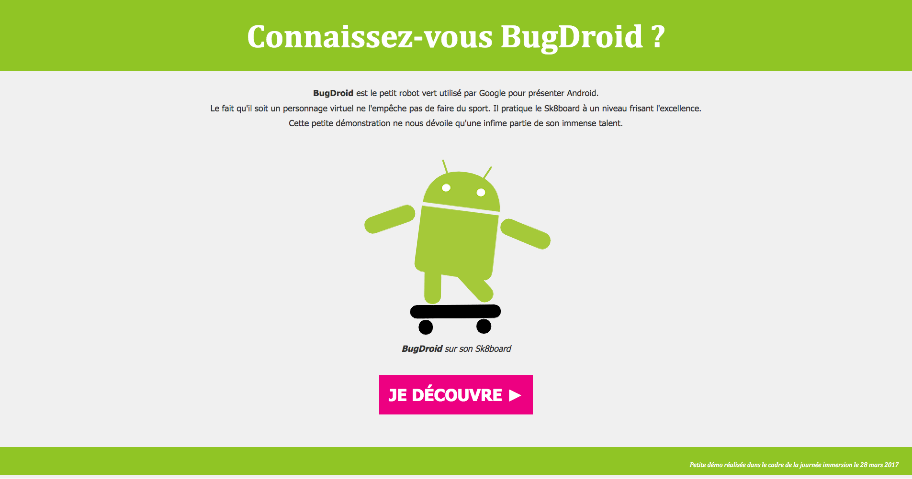

# Immersion "Bugdroid"

> CSS exercise given at HEPL

* * *

**Immersion "Bugdroid"** is an educational project, which will be used for `HTML`/`CSS` courses.

**Note:** the school where the course is given, the [HEPL](http://www.provincedeliege.be/hauteecole) from Liège, Belgium, is a french-speaking school. From this point, the instruction will be in french. Sorry.

* * *

> Lors de vos cours de *web*, vous allez découvrir les langages HTML et CSS et les mettre en pratique pour apprendre à créer des pages web.  

* * *

## BugDroid

Vous trouverez dans ce dossier une page HTML nommée **index.html**. Cette page présente le robot Bugdroid.  

Votre mission est

1. de baliser le texte en utilisant le langage HTML ;
2. de créer la feuille de style qui donnera à cette page le rendu suivant&nbsp;:

* * *

Code par [Myriam Dupont](https://github.com/myriamdupont) d’après un code de Vincent de Oliveira.
